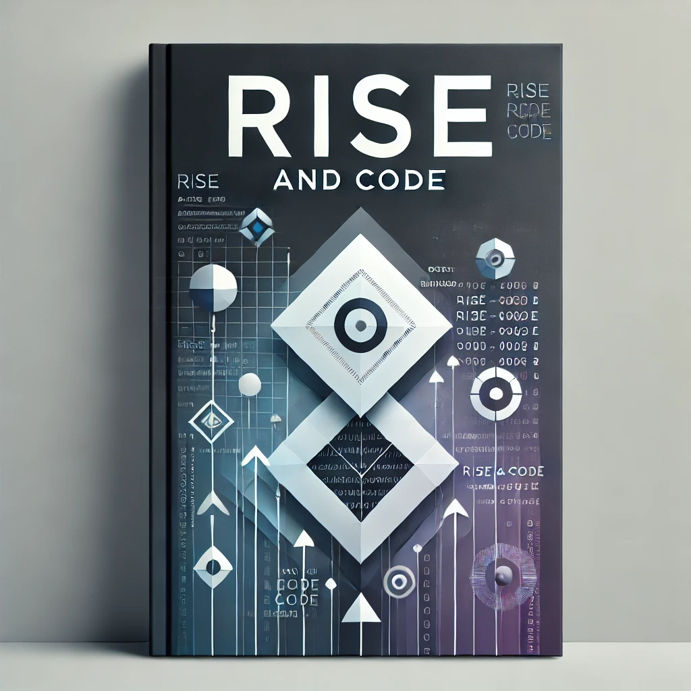

# Rise & Code

[](https://github.com/iksnae/rise-and-code/actions/workflows/build-book.yml)
[](https://github.com/iksnae/rise-and-code/releases/latest)
[](https://creativecommons.org/licenses/by-nc-sa/4.0/)

A free, open-source book designed to teach programming, software development, and logical problem-solving to people without access to computers.

<div align="center">
  <a href="https://github.com/iksnae/rise-and-code/releases/latest">
    
  </a>
  <a href="https://github.com/iksnae/rise-and-code/releases/latest">
    
  </a>
</div>

## Available Formats

The book is available in the following formats:

- **PDF**: Professionally formatted with LaTeX, ideal for printing or reading on larger screens
- **EPUB**: Optimized for e-readers and mobile devices, with reflowable content
- **HTML**: Online readable version on our [GitHub Pages site](https://iksnae.github.io/rise-and-code/)
- **Markdown**: Raw content files for those who want to contribute or create custom formats

### Language Versions

Each format is available in multiple languages:

- English: [PDF](https://github.com/iksnae/rise-and-code/releases/latest) | [EPUB](https://github.com/iksnae/rise-and-code/releases/latest) | [HTML](https://iksnae.github.io/rise-and-code/)
- Spanish (Español): [PDF](https://github.com/iksnae/rise-and-code/releases/latest) | [EPUB](https://github.com/iksnae/rise-and-code/releases/latest) | [HTML](https://iksnae.github.io/rise-and-code/es/)

## About This Project

"Rise & Code" makes the exciting world of programming accessible to everyone, regardless of age, background, or access to technology. Through interactive lessons, engaging visuals, and a unique notebook methodology, it offers a fresh and empowering approach to learning code.

### Key Features

- **No Computer Required**: Learn programming concepts using just pen and paper
- **Hands-on Activities**: Every chapter includes practical exercises and activities
- **Visual Learning**: Concepts illustrated through diagrams and flowcharts
- **Progressive Curriculum**: Builds skills gradually from foundational to advanced topics
- **Inclusive Design**: Created for diverse audiences with different learning styles
- **Open Source**: Freely available to share, print, and distribute

### Our Mission

- Make programming education accessible to underserved communities
- Teach computational thinking through unplugged activities
- Build foundational skills that transfer to any programming language
- Create a resource that can be freely shared, printed, and distributed

## Current Status

The project currently has draft content for all 9 primary chapters, covering a comprehensive introduction to programming concepts without requiring a computer. We're actively improving the content and welcome contributions from the community.

- **Completed**: Basic structure, chapter outlines, and core content for chapters 1-9
- **In Progress**: Refining activities, improving explanations, enhancing illustrations
- **Coming Soon**: Chapter 10 (Appendices) and final polishing

## Book Structure

1. **Introduction: The World of Coding Without a Computer**
   - Why Programming Matters
   - Who This Book Is For
   - How to Use This Book (Including the Notebook Method)

2. **The Human Compiler: Understanding Logic and Structure**
   - Basic Logic and Decision Making
   - Conditional Statements and Flowcharts
   - Pseudo Coding

3. **Playful Programming: Fun with Algorithms**
   - Creating Simple Algorithms
   - Hands-on Exercises and Games
   - Building Complexity

4. **Data Explorers: Understanding Variables and Data Types**
   - What is Data?
   - Types of Data and Variables
   - How to Manipulate Data

5. **Control Creators: Loops and Repetition**
   - Understanding Loops
   - Crafting Repetitive Tasks
   - Real-world Looping Examples

6. **The Engineering Notebook: Practicing Like a Pro**
   - Benefits of Keeping a Coding Journal
   - How to Document Ideas and Progress
   - Tips for Effective Note-taking

7. **Coding Challenges: Building Skills Through Practice**
   - Series of Engaging Coding Challenges
   - Hints and Guided Solutions
   - Encoded Answer Keys

8. **Real-world Applications: Connecting Coding to Everyday Life**
   - Applying Programming to Real Problems
   - Coding in Various Industries
   - The Future of Coding Skills

9. **Beyond the Book: Next Steps in Your Coding Journey**
   - Resources for Further Learning
   - Pursuing a Career in Tech
   - Continuing the Coding Adventure

10. **Appendices**
    - Glossary of Key Terms
    - Answer Key and Solution Guide
    - Recommended Reading and Tools

## Sample Activities

Each chapter contains hands-on activities to reinforce learning:

- **Your First Algorithm**: Create step-by-step instructions for everyday tasks
- **Human Robot Game**: Experience how computers follow instructions
- **Variable Tracker**: Visualize how data changes during program execution
- **Loop Pattern Recognition**: Identify repetition in the world around you
- **Secret Codes**: Apply data transformation through cryptography exercises
- **Algorithm Trading Cards**: Create collectible cards with reusable algorithms

## Getting the Latest Version

The book is automatically built and published as releases. You can access the latest version in the following formats:

- **PDF**: A beautifully formatted PDF ready for reading or printing
- **EPUB**: An electronic book format optimized for e-readers and mobile devices
- **Markdown**: A single markdown file containing all content
- **HTML**: An online readable version

To get the latest version:

1. Go to the [Releases page](https://github.com/iksnae/rise-and-code/releases/latest)
2. Download your preferred format from the assets section
3. You can also read the HTML version directly on our [GitHub Pages site](https://iksnae.github.io/rise-and-code/)

### Reading EPUB Files

EPUB files can be opened with various e-reader apps and software:

- **Mobile Devices**: Apple Books, Google Play Books, Kobo, and other e-reader apps
- **Desktop**: Calibre, Adobe Digital Editions, or browser extensions like EPUBReader
- **E-Readers**: Kindle (may require conversion), Kobo, Nook, and other e-ink devices

## Repository Structure

The project is organized with the following directory structure:

```
rise-and-code/
├── .github/           # GitHub Actions workflows
├── book/              # Main book content
│   ├── title-page.md  # Book title page
│   ├── chapter-01/    # Each chapter in its own directory
│   │   ├── README.md  # Chapter introduction
│   │   ├── sections/  # Chapter sections
│   │   ├── activities/# Chapter activities
│   │   └── chapter-summary.md  # Chapter summary
│   ├── chapter-02/    # Additional chapters...
│   └── ...
├── build/             # Generated output (not in repo)
├── templates/         # LaTeX templates for PDF generation
└── tools/             # Build scripts and utilities
```

Each chapter follows a consistent structure:
- `README.md`: Introduction, objectives, and overview of the chapter
- `sections/`: Core content divided into focused, sequential sections
- `activities/`: Hands-on exercises with clear instructions and examples
- `chapter-summary.md`: Recap of key concepts, reflections, and preview of the next chapter

## Building the Book Locally

To build the book on your local machine:

1. Clone this repository
2. Install Node.js (v14 or higher)
3. Install dependencies:
   ```
   npm install
   ```
4. Run the build script:
   ```
   npm run build
   ```
5. Find the outputs in the `build` directory

The build process:
- Collates all markdown files according to the chapter structure
- Generates a single markdown file with proper formatting
- Creates a PDF version with formatting and page breaks between sections
- Uses LaTeX templates for professional PDF output

For more detailed build instructions, see [tools/README.md](tools/README.md).

## Contributing

We welcome contributions to this project! The book is designed to be a collaborative effort, and we need help with content writing, editing, activities development, and more.

### How You Can Help

- **Content Creation**: Add or improve explanations, examples, and activities
- **Editing**: Review content for clarity, accuracy, and accessibility
- **Translation**: Help make the book available in more languages
- **Illustration**: Create visual aids to support learning concepts
- **Testing Activities**: Try out the unplugged activities and provide feedback
- **Technical Improvements**: Enhance build scripts and PDF generation

Please see [CONTRIBUTING.md](CONTRIBUTING.md) for comprehensive guidelines on:
- Content formatting and style
- Chapter structure and organization
- Activity development guidelines
- Pull request process
- Code of conduct

## Development Process

This project uses continuous integration to automatically build and publish new versions of the book:

- **Build Automation**: GitHub Actions automatically builds the book when changes are pushed
- **Versioning**: Each build gets a unique version tag based on the date and time
- **Release Management**: Completed builds are published as GitHub releases
- **Testing**: You can manually trigger builds from the Actions tab

## PDF Output Format

The PDF version of the book includes:
- Professional typesetting with LaTeX
- Proper pagination with Roman numerals for front matter and Arabic for main content
- Each chapter starting on a new page
- Each section starting on a new page for clear organization
- Table of contents for easy navigation
- Consistent formatting and typography
- Page headers and footers with page numbers

## License

This book is released under the Creative Commons Attribution-NonCommercial-ShareAlike 4.0 International License (CC BY-NC-SA 4.0). This means you are free to:

- Share — copy and redistribute the material in any medium or format
- Adapt — remix, transform, and build upon the material

Under the following terms:
- Attribution — You must give appropriate credit
- NonCommercial — You may not use the material for commercial purposes
- ShareAlike — If you remix, transform, or build upon the material, you must distribute your contributions under the same license as the original

## Contact

For questions, suggestions, or to get involved:
- Open an issue in this repository
- Submit a pull request with your contribution
- Star the repository to show your support

Join us in making programming education accessible to everyone, regardless of their access to technology!
