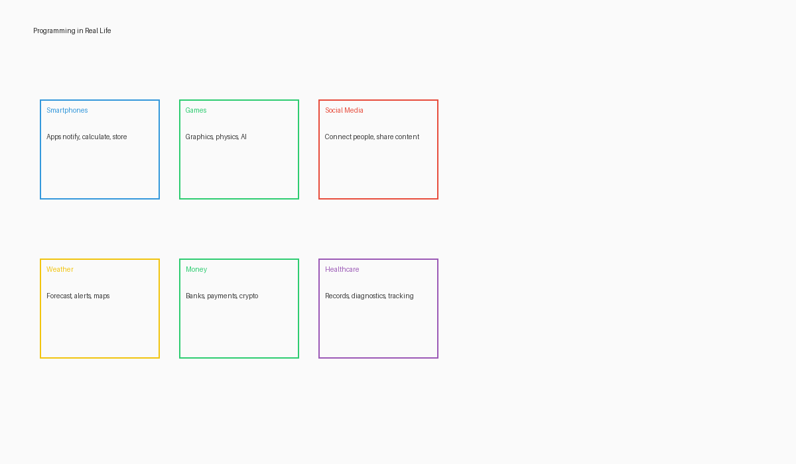

# Why You Should Code

## Introduction

Imagine a world where you could tell a machine exactly what you want it to do, and it would do it perfectly every time. That's the power of programming. But programming is about much more than just controlling computers—it's about developing a way of thinking that helps you solve all kinds of problems.

## What is Programming?

At its heart, programming is giving instructions to a computer. But unlike humans, computers need extremely precise instructions. They follow exactly what you tell them to do—no more, no less. 

Think about giving directions to a friend versus a stranger in a new city. With your friend, you might say, "Meet me at the usual café." The friend fills in the gaps using shared knowledge. But with a stranger, you need to provide every detail: which streets to take, landmarks to watch for, and exactly how to recognize the café.

Programming is like giving directions to that stranger—who also happens to be incredibly fast, never gets tired, and follows your instructions exactly.

## Programming in Everyday Life

You may not realize it, but you're surrounded by programming every day:

- When you withdraw money from a bank machine
- When traffic lights change based on the time of day
- When your mobile phone notifies you about a message
- When farmers use automated irrigation systems
- When health workers track disease outbreaks

All of these systems run on instructions written by programmers. And increasingly, knowing how to program—or at least understanding how programming works—is becoming an essential skill for many jobs and opportunities.

## Why Learn Programming Without a Computer?

You might be wondering: "How can I learn programming without a computer?" It's a fair question!

Think about learning to play a musical instrument. Before a concert pianist performs on stage, they spend countless hours understanding music theory, practicing finger positions, and training their musical thinking.

Similarly, programming begins in the mind. The fundamental skills of programming are about:

- Breaking down problems into smaller, manageable parts
- Creating clear, step-by-step instructions
- Recognizing patterns and creating efficient solutions
- Developing logical thinking

All of these skills can be learned and practiced without touching a computer! In fact, developing these skills first can make you a much stronger programmer when you eventually do use a computer.

## The Benefits of Programming Thinking

Learning to think like a programmer offers many benefits:

1. **Problem-solving skills**: Programming teaches you to approach complex problems systematically, breaking them down into smaller, more manageable pieces.

2. **Logical thinking**: Programming requires clear, logical thought processes that can help in many areas of life and work.

3. **Creativity**: Despite its technical nature, programming is deeply creative—there are endless ways to solve any problem.

4. **Attention to detail**: When programming, small details matter. This mindfulness transfers to other areas of life.

5. **Persistence**: Debugging (fixing problems in code) teaches patience and persistence in the face of challenges.

6. **Career opportunities**: Programming skills open doors to jobs in virtually every industry, from agriculture to healthcare to education.

Even if you never write code professionally, understanding how to think like a programmer will help you in our increasingly digital world.

## Activity: Identifying Programming in Your Community

**Materials needed**: Notebook and pencil

**Instructions**:
1. In your notebook, make a list of at least 5 places or situations in your community where you think programming is being used.
2. For each example, write down:
   - What the system or device does
   - Who benefits from it
   - How it might be working behind the scenes
3. Think about one problem in your community that could be solved with a programmed solution.
4. Share your ideas with others, if possible.

## Key Takeaways

- Programming is about giving precise instructions to computers
- Computational thinking is valuable even without a computer
- Programming influences many aspects of daily life
- Learning to think like a programmer develops important skills
- You can start learning programming concepts with just a notebook and pencil

In the next section, we'll talk about who can benefit from this book and how to get the most out of it.