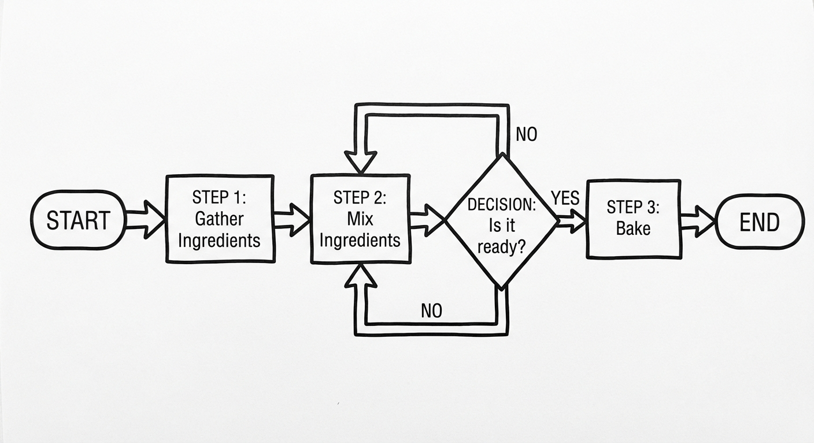
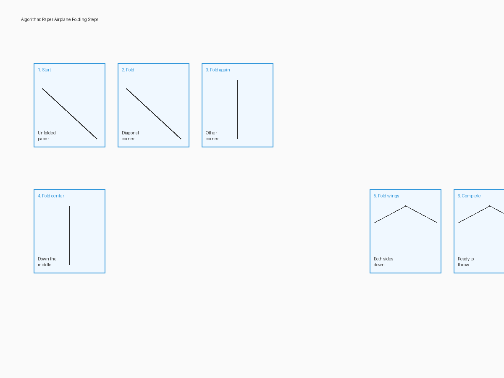
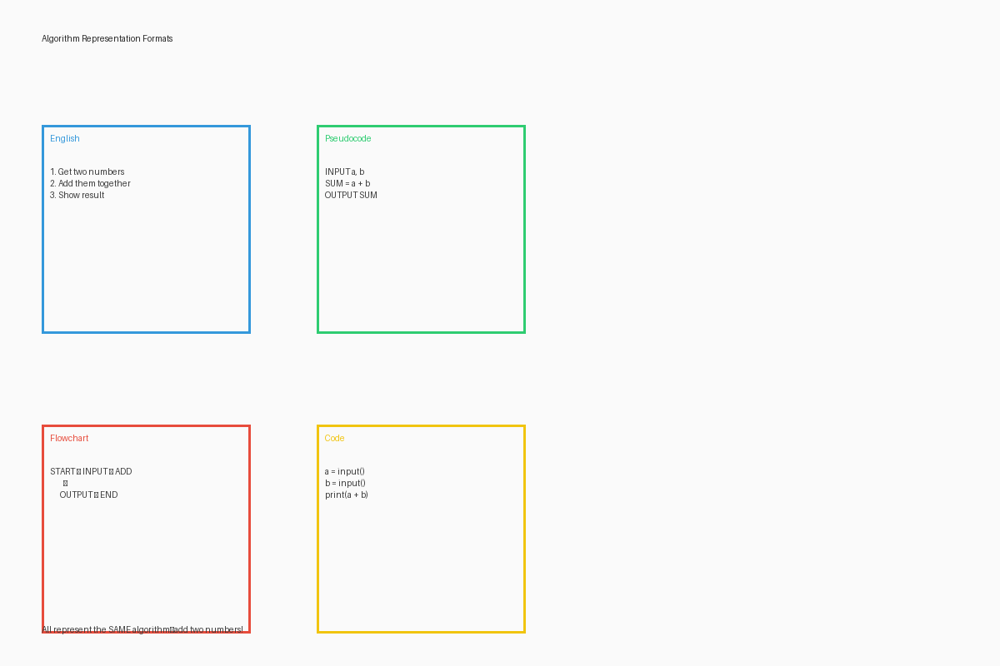
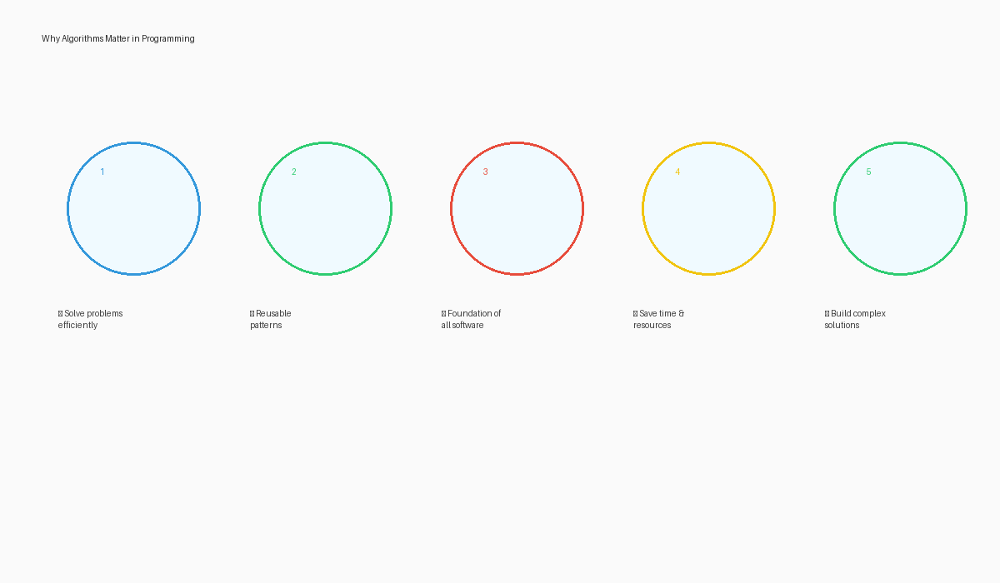

# Build Algorithms Step by Step

## Introduction

Imagine you're teaching a younger sibling how to make their favorite sandwich, or giving directions to a visitor in your town. In both cases, you're creating an algorithm—a step-by-step set of instructions to accomplish a task or solve a problem. In this section, we'll explore what algorithms are, why they matter, and how to create effective ones.

## What is an Algorithm?

An algorithm is a set of clear, precise instructions that describe how to perform a task or solve a problem. Algorithms have several key characteristics:

1. **Finite**: They must eventually end after a certain number of steps
2. **Definite**: Each step must be precisely defined and unambiguous
3. **Effective**: They must be capable of being done by a person or machine
4. **Input**: They take some input (which might be zero inputs)
5. **Output**: They produce a result or output



Every time you follow a recipe, use a manual, or give directions, you're working with algorithms. In programming, algorithms are the foundation of everything a computer does—from simple calculations to complex artificial intelligence.

## Algorithms in Everyday Life

Before we dive into creating algorithms, let's identify some common algorithms we encounter daily:

- **Recipes**: Step-by-step instructions to prepare a dish
- **Assembly instructions**: Guides for putting together furniture or toys
- **Travel directions**: Instructions to get from one place to another
- **Morning routines**: The sequence of actions you take to start your day
- **Games**: The rules and procedures for playing

Take a moment to think about the algorithms you follow in your daily life. What makes some easier to follow than others?

## The Elements of a Good Algorithm

A good algorithm has these qualities:

1. **Clarity**: Instructions are easy to understand
2. **Precision**: Each step is clearly defined without ambiguity
3. **Efficiency**: It accomplishes the task with minimal unnecessary steps
4. **Correctness**: It correctly solves the intended problem
5. **Generality**: It works for all valid inputs within its domain

## Creating Your First Algorithm

Let's walk through the process of creating a simple algorithm together. We'll use the example of making a paper airplane:

1. **Identify the goal**: Create a paper airplane that can fly
2. **Break down the task**: Think about the major steps involved
3. **Order the steps**: Arrange them in a logical sequence
4. **Be precise**: Make each instruction clear and specific
5. **Test and refine**: Try following the steps and improve as needed



Here's our algorithm for making a simple paper airplane:

```
Algorithm: Making a Paper Airplane

1. Start with a rectangular sheet of paper
2. Place the paper on a flat surface with the long edges at the top and bottom
3. Fold the paper in half by bringing the top edge to the bottom edge
4. Crease the fold firmly and unfold the paper
5. Fold the top left and right corners down to meet the center line
6. Fold the top edges to the center line
7. Fold the entire plane in half along the center line
8. Fold down the wings so they're perpendicular to the body
9. Test fly the airplane
10. Make adjustments as needed for better flight
```

Notice how each step is clear and specific. There's no ambiguity about what to do next.

## Levels of Detail in Algorithms

One challenge in algorithm design is deciding how detailed to be. Consider step 5 above: "Fold the top left and right corners down to meet the center line." Is this clear enough? It depends on your audience.

For someone who has made paper airplanes before, this is probably sufficient. For someone who has never folded paper, you might need more details:

```
5a. Identify the top left corner of the paper
5b. Identify the center line created by the initial fold
5c. Gently bend the top left corner toward the center line
5d. Align the left edge with the center line, creating a diagonal fold
5e. Press down to crease the fold firmly
5f. Repeat steps 5a-5e with the top right corner
```

This level of detail would make the algorithm longer but more accessible to beginners. When designing algorithms, consider:

- Who will be following these instructions?
- What prior knowledge can you assume?
- How critical is it that each step be performed exactly right?

## Representing Algorithms

Algorithms can be represented in various ways:

1. **Natural language**: Step-by-step written instructions (like our paper airplane example)
2. **Flowcharts**: Visual diagrams showing the steps and decision points
3. **Pseudocode**: A mixture of natural language and programming-like notation
4. **Actual code**: Instructions written in a programming language



Each representation has its strengths. In this book, we'll use all of these methods, starting with natural language and gradually introducing more formal representations.

## Why Algorithms Matter in Programming

In programming, algorithms are essential because:

1. **Computers need explicit instructions**: Unlike humans, computers can't fill in gaps or make assumptions
2. **Efficiency matters**: Well-designed algorithms can save significant time and resources
3. **Problem-solving framework**: Breaking problems into algorithmic steps is a powerful approach
4. **Communication tool**: Algorithms help programmers share and discuss solutions
5. **Foundation for learning**: Understanding algorithms helps when learning any programming language



## Activity: Algorithm Awareness

Before moving on to the hands-on activities, take a few minutes to list three everyday activities you regularly perform. For each activity:

1. Identify the inputs (what you start with)
2. List the major steps involved
3. Describe the output or result
4. Note any decision points where you might do different things based on conditions

This simple exercise will help you start thinking algorithmically about your daily life.

## Key Takeaways

- Algorithms are step-by-step instructions for solving problems or completing tasks
- Good algorithms are clear, precise, efficient, correct, and general
- Algorithms exist all around us in everyday life, not just in computing
- The level of detail in an algorithm should match the needs of the audience
- Algorithms can be represented in various ways, from natural language to code
- Thinking algorithmically is a valuable skill in programming and beyond

In the next section, we'll explore hands-on exercises and games that will help you practice creating and following algorithms in fun, interactive ways.
