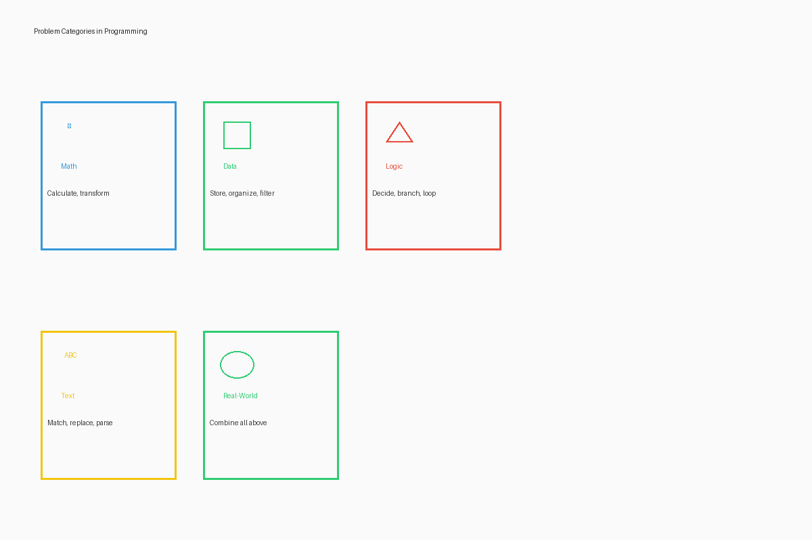

# Solve Real Problems with Code

## Introduction

Throughout this book, you've been learning programming concepts, practicing algorithms, and developing computational thinking skills—all without a computer. You might be wondering: "How do these abstract concepts connect to solving real problems in the world around me?"

In this section, we'll explore how the skills you've developed—breaking down problems, creating algorithms, using variables and loops, documenting your thinking—apply directly to addressing real challenges. Programming isn't just about making computers do things; it's about developing a powerful approach to problem-solving that works across countless domains and situations.

## The Problem-Solving Cycle

At its heart, programming is a method for solving problems following a consistent cycle:

1. **Problem Identification**: Clearly defining the problem to be solved
2. **Analysis**: Breaking down the problem into manageable components
3. **Solution Design**: Creating algorithmic approaches to address each component
4. **Implementation**: Converting designs into actual instructions or code
5. **Testing**: Verifying that the solution works as intended
6. **Refinement**: Improving the solution based on testing results

This cycle applies whether you're writing code on a computer or addressing challenges in entirely different contexts. Let's explore how this works in practice.

## Identifying Problems Worth Solving

Before diving into solutions, skilled programmers spend time identifying and understanding problems that truly matter. Here are some categories of real-world problems where programming approaches can make a difference:

### Efficiency Problems
- Reducing time spent on repetitive tasks
- Streamlining complicated processes
- Minimizing errors in manual operations
- Optimizing resource allocation

### Information Problems
- Organizing large amounts of data
- Finding patterns in complex information
- Tracking changes over time
- Making predictions based on historical data

### Communication Problems
- Connecting people across distances
- Translating between languages or formats
- Visualizing complex concepts
- Sharing knowledge effectively

### Resource Problems
- Managing limited supplies
- Reducing waste
- Improving distribution systems
- Monitoring usage patterns

### Social Problems
- Improving access to education
- Enhancing healthcare delivery
- Supporting community organization
- Addressing environmental challenges

Remember that the best problems to solve are often those that:
1. Affect many people
2. Occur frequently
3. Have significant impact
4. Currently lack good solutions
5. Connect to your own interests or community needs

## Computational Thinking in Action

Let's see how the computational thinking skills you've developed apply to real situations:

### Decomposition: Breaking Down Complex Problems

**Programming Concept**: Dividing a large problem into smaller, manageable sub-problems.

**Real-World Application**: A community facing water shortages might break the challenge into:
- Measuring current usage patterns
- Identifying sources of waste
- Developing conservation strategies
- Creating educational materials
- Implementing monitoring systems

By breaking down the large problem of "water shortage" into specific components, the community can work on manageable pieces rather than being overwhelmed by the whole.

### Pattern Recognition: Finding Similarities and Repeats

**Programming Concept**: Identifying patterns to apply known solutions to similar problems.

**Real-World Application**: A healthcare worker tracking disease outbreaks might:
- Notice that cases spike after certain community events
- Recognize seasonal patterns in specific illnesses
- Identify common transmission patterns between different outbreaks
- Apply preventive measures that worked in previous similar situations

Pattern recognition helps them apply existing knowledge rather than starting from scratch with each new situation.

### Abstraction: Focusing on Essential Information

**Programming Concept**: Removing unnecessary details to concentrate on what's important.

**Real-World Application**: A teacher creating a school schedule might:
- Focus only on room capacity, subject, and teacher availability
- Ignore irrelevant details like room color or desk arrangement
- Create a simplified model that captures just the essential scheduling constraints
- Develop a general approach that works for different school years

Abstraction prevents becoming overwhelmed by excessive details, allowing focus on what truly matters.

### Algorithm Design: Creating Step-by-Step Solutions

**Programming Concept**: Developing precise, repeatable procedures to solve problems.

**Real-World Application**: A farmer optimizing irrigation might create an algorithm:
1. Check soil moisture in different sections (input)
2. Compare moisture levels to ideal ranges for each crop
3. Calculate water needed for each section
4. If rainfall is predicted within 24 hours, reduce water amounts
5. Apply water to each section based on calculations
6. Record water usage and resulting moisture levels (output)

This algorithmic approach ensures consistent, optimal irrigation rather than guesswork.

## From Individual to Community Impact

The programming concepts you've learned can scale from solving personal problems to addressing community challenges:

### Personal Level
- Creating a studying schedule with efficient time allocation
- Developing a budgeting system to manage personal finances
- Designing an exercise routine that progresses systematically
- Organizing a collection of books, music, or other items

### Family Level
- Creating fair chore distribution algorithms
- Developing meal planning systems that account for preferences and nutrition
- Optimizing shared space usage in a home
- Managing family schedules and coordination

### Community Level
- Designing efficient systems for community resource sharing
- Developing plans for emergency response coordination
- Creating educational programs that adapt to different learning needs
- Organizing transportation solutions for areas with limited options

### Global Level
- Contributing to citizen science data collection methods
- Participating in distributed problem-solving initiatives
- Developing solutions that can be adapted across different contexts
- Sharing knowledge and approaches through open-source methodologies

## Case Study: The Barefoot Solar Engineers

One inspiring example of programming concepts applied to real-world problems without traditional computer programming comes from the "Barefoot College" in India. This organization trains rural women—many of whom have limited formal education and no prior technical experience—to become solar engineers who build and maintain solar lighting systems for their villages.

### How Programming Concepts Apply:
- **Decomposition**: Breaking down solar systems into components like panels, batteries, and circuits
- **Algorithms**: Learning step-by-step procedures for installation and troubleshooting
- **Variables**: Understanding how different factors (sunlight hours, battery capacity, usage patterns) affect system performance
- **Conditional Logic**: Diagnosing problems using if-then reasoning (if the light doesn't work but the battery is charged, then check the connection)
- **Documentation**: Maintaining records of installations and creating maintenance schedules

These women don't write computer code, but they apply computational thinking to bring sustainable electricity to communities that previously relied on kerosene lamps. Their work demonstrates how programming concepts can create real impact even without computers.

## Starting with What You Have

You don't need advanced technology to start applying programming concepts to real problems. Here are approaches that work with minimal resources:

### Paper-Based Systems
- Designing forms for data collection and analysis
- Creating decision trees for complex processes
- Developing tracking systems using notebooks and visual indicators
- Building paper databases with cross-referencing systems

### Human Computation
- Organizing people to perform distributed calculations
- Creating human chains for efficient information passing
- Developing manual data verification through redundant checks
- Implementing physical sorting algorithms with community participation

### Visual Management
- Using kanban-style boards to track work progress
- Implementing color-coding systems for quick status identification
- Creating physical dashboards to display community metrics
- Designing information radiators that make data visible and actionable

### Low-Tech Automation
- Designing gravity-fed water distribution systems
- Creating mechanical timers for resource management
- Building passive systems that sort or filter physical items
- Developing self-monitoring processes with visual indicators

## Activity: Problem Identification Workshop

Before we end this section, take some time to identify problems in your own context that might benefit from computational thinking approaches:

1. In your notebook, create three columns labeled:
   - "Personal/Family Problems"
   - "School/Work Problems"
   - "Community Problems"

2. Under each column, list at least three problems you've observed

3. For each problem, briefly note:
   - Who is affected
   - Why it matters
   - Current approaches (if any)
   - Potential computational thinking approaches

4. Circle the one problem that:
   - Has significant impact
   - You care about personally
   - Might be approachable with the skills you have

This identified problem will be useful as we continue exploring applications throughout this chapter.

## Key Takeaways

- Programming concepts apply far beyond computer coding to real-world problem-solving
- Computational thinking—decomposition, pattern recognition, abstraction, and algorithms—provides a powerful framework for addressing challenges
- Programming approaches can scale from personal to global impact
- Even without computers, these concepts can be applied using paper, people, and simple tools
- Identifying meaningful problems is the first step in creating valuable solutions
- Your programming knowledge gives you a unique lens for seeing and addressing challenges in your community

In the next section, we'll explore how programming skills are applied across different industries and careers, from agriculture to healthcare, education to entertainment, revealing the diverse opportunities that computational thinking can open.
